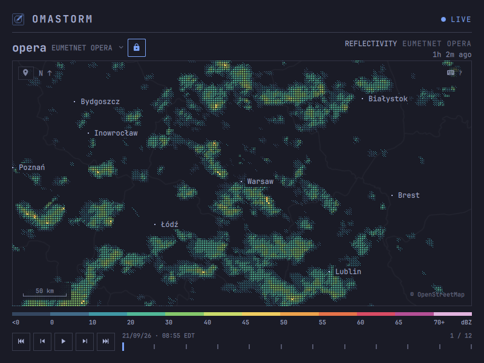

# Omastorm

Live weather radar in your Omarchy bar. Beta.

<p align="center">
  
</p>

A radar that lives next to the clock. The popover shows your selected radar
and its actual scan time. Click the map (or press Enter) for the full
window: individual NOAA NEXRAD sweeps in the U.S. and the EUMETNET OPERA
European mosaic, drawn in your Omarchy theme.

This page is the user guide: install, first run, and everyday use. How the
code is built lives in [CONTRIBUTING.md](CONTRIBUTING.md).

## Install

Omarchy 4 on x86_64 and aarch64.

```sh
omarchy plugin add https://github.com/wesleygrimes/omastorm.git --enable
```

That clones the plugin, asks which bar section to use, and on first open
downloads the pinned engine from GitHub Releases, checks its sha256, and
installs it under `~/.local/share/omastorm/bin`. Configuration, remembered
view, and cached scans stay in Omastorm's own directories.

Optional: a Hyprland key to toggle the window. Add one line to
`~/.config/hypr/bindings.lua`. Omastorm never writes that file:

```lua
o.bind("SUPER + SHIFT + R", "Omastorm", "omarchy shell shell toggle com.omastorm.radar '{}'")
```

Optional: list it in the app launcher:

```sh
bash ~/.config/omarchy/plugins/com.omastorm.radar/scripts/write-desktop-entry.sh
```

## First run

Open the popover from the bar. If Omarchy weather already has a city, the
map opens there. If not, you get a choice: pick a place, or use an
approximate location.


**Use approximate location** is one click. It asks [wttr.in](https://wttr.in)
to guess your city from the public IP of that request. Nothing is sent until
you click; there is no GPS and no background tracking. A VPN or CGNAT may
land you at the ISP instead of your house. Choose manually if the guess is
wrong.

The view is remembered. Next time you open the popover, you are back where
you left off.

## Coverage

U.S. radar comes from NOAA NEXRAD; European radar comes from EUMETNET
OPERA. Coverage depends on radar range and the data available from each
provider. Some areas have no radar data, even when their cities appear in
search.

[](https://github.com/wesleygrimes/omastorm/releases/download/v0.1.14/omastorm-europe.mp4)

[Watch the 24-second Europe demo](https://github.com/wesleygrimes/omastorm/releases/download/v0.1.14/omastorm-europe.mp4).

## What you are looking at

Omastorm currently uses two radar products. In the U.S., NOAA NEXRAD provides
individual radar volumes: each dish spins, sends a pulse, and measures how
much bounced back. In Europe, EUMETNET OPERA provides a mosaic
combining the strongest radar returns at each location.

For NEXRAD, Omastorm shows **reflectivity** on the lowest tilt: the beam that
stays closest to the ground. OPERA combines multiple radars and elevations into one image.

Color is **dBZ**, not a rain rate and not a warning. Stronger return, warmer
color. The legend under the map is that scale.

A bright blob is often rain or snow. Radar can also detect:

- insects, birds, and bats (especially on clear evenings)
- dust, smoke, and sea spray
- ground clutter and buildings near the dish
- anomalous propagation, when the beam bends and paints the ground far away
- wind farms, towers, and military chaff

Measured returns under 5 dBZ (the usual biological clutter and haze) are
hidden by default; the legend says so. Press `w` to show them.

These are observations, not forecasts or weather warnings. Each frame shows
its observation time on the stamp.

## The window

Drag to pan, scroll to zoom. The map and the radar are independent: panning
moves the camera; the active source is whichever covering radar Omastorm is
following, unless you lock it.

Click the source name for covering mosaics and nearby dishes. The padlock pins
that source so panning will not hand off; it turns yellow when the camera sits
outside the source's coverage. `n` resumes automatic selection for the current
map centre and leaves the camera where it is.

The number under the product line is how stale the frame on screen is. The
stamp above the timeline is when that frame was observed. **LIVE** is the
feed; the light beside it goes yellow when data is stale (ten minutes) and
red when the feed is unreachable. Cached frames stay.

A scale bar on the map is ground distance, in kilometres or miles from your
locale.

## Aviation observations

Press `a` in the window or popover to show nearby airport weather reports on
the map. Airport codes replace city labels; their colors show the reported
flight category: green VFR, blue MVFR, red IFR, and magenta LIFR. Click an
airport code to read its raw METAR. These are current observations, not
forecasts or flight guidance.

The overlay is off by default and works with live NEXRAD radar in the U.S. and
Canada. It is unavailable on the European OPERA mosaic. To start with it on,
set `[metar] show = true` in your configuration. You can also choose how many
airports appear and how they are selected; see [configuration](docs/configuration.md#display-and-keyboard-preferences).

<p align="center">
  
  
</p>

## Search

`/` (or `s`) is one field. Type a city, a radar site or mosaic name, or paste coordinates.

A **city** centres the map there, unlocks, and selects a covering source. Type
a region or country qualifier when needed, such as `London, UK`.
Cities come from the bundled GeoNames database. A configured radar override
still applies when choosing a place.


A **site** (`KTLX`, `tlx`) locks that dish and centres on it. Clicking the
source title opens the same card on covering mosaics and nearby dishes.

A **mosaic** (`opera`) locks that source and centres the map on its coverage.


**Coordinates** are latitude then longitude, decimal degrees, comma or space,
the way a maps link looks. Invalid range is named on the card; the layout
does not jump.


## My location

The map-marker at the top-left of the map, or `m`, jumps to the same
approximate IP location as first run. Zoom stays. The radar unlocks and
follows. Archived sessions never locate.

If the lookup fails, the camera stays put and a short overlay appears on the
map. It is not a new row of chrome.


## The loop

Selecting a radar loads its recent scans for playback. NEXRAD history grows
toward **60 frames / two hours**;
OPERA retains up to **12 mosaic frames**. Older scans drop out. Space loops
what is available; `[` `]` steps; Home and End jump.

NOAA publishes NEXRAD Level II via the [Open Data program on AWS](https://registry.opendata.aws/noaa-nexrad/).
A full volume takes about four to seven minutes (faster in severe weather,
slower in clear air). While a volume is in progress the engine reads live
chunks, so the sweep can paint as the antenna turns. If no new chunk arrives
for 90 seconds it rediscovers the latest volume; cached frames stay. OPERA
polls its public 24-hour cache and loads complete mosaic frames.

## Look

Three treatments sample the same radar data and palette. They only change how each
3 px cell is painted. Glyphs is the default; `1` `2` `3` switch.

| Key | Treatment | Look |
| --- | --- | --- |
| `1` | Pixels | Solid blocks. The most literal picture of each radar cell. |
| `2` | Glyphs | A denser mark as the return strengthens. |
| `3` | Stipple | Soft squares that grow with intensity; more map shows through. |


Chrome follows the Omarchy theme. Radar color comes from the measured reflectivity.

<p align="center">
  
</p>

`?` lists every key. They are all rebindable.

| Key | Action |
| --- | --- |
| `h` `j` `k` `l` or arrows | Pan |
| `+` `-` | Zoom |
| `0` | Reset to the configured or weather location |
| `/` or `s` | Search |
| `n` | Follow the covering radar (camera stays) |
| `Shift+L` | Lock the radar |
| `m` | My location |
| Space | Play / pause the loop |
| `[` `]` | Step a frame |
| Home / End | Oldest or newest frame |
| `1` `2` `3` | Pixels, Glyphs, Stipple |
| `w` | Show weak returns |
| `a` | Show or hide aviation observations |
| `?` | This map |
| Esc | Close |

## Preferences

## Configuration

`~/.config/omastorm/config.toml` holds deliberate preferences. The app saves
last map center, zoom, and UI radar lock separately in
`$XDG_STATE_HOME/omastorm/state.json` (default
`~/.local/state/omastorm/state.json`). Navigation never rewrites your config.
`Shift+H`, or LOCATION, opens the location picker; it writes state, not config.

Explicit center coordinates win on every launch. Without them, Omastorm
restores your last view, then falls back to the weather location or location
picker. Radar selection is independent: a configured lock wins, otherwise a
remembered lock is restored, otherwise the nearest radar follows the map.
With a GPS receiver on a running `gpsd`, `gpsd = true` makes the map follow
the receiver once a view exists, handing the radar off as you drive. The
crosshair on the map is the follow chip: click to pause and resume; `NO FIX`
shows when the receiver is silent.

```toml
# Optional: always open here. Omit both to remember the last map position.
center_lat = 36.23708
center_lon = -79.97948
# locked_radar = "KFCX" # optional radar override; coordinates do not imply a lock
# gpsd = true           # optional: follow a GPS receiver on the local gpsd

treatment = "GLYPHS"  # PIXELS, GLYPHS, or STIPPLE at launch
weak_floor = 5        # dBZ; false draws every measured return

[metar]
show = true           # optional; start with airport reports on the map

[keys]
pan_left = "h Left"
zoom_in = "+ ="
```

A bad value is named in the status slot and that setting stays on its
default. Keys are Qt sequences; an empty string unbinds. `1` `2` `3` change
treatment, `w` changes the weak-return floor, and `a` toggles aviation mode
for the session without writing the file.

## Update

```sh
omarchy plugin update com.omastorm.radar
omarchy restart shell
```

Until the restart, the shell keeps running what it loaded at login, old
engine pin included. Omastorm notices the new files and says so; clicking
that notice in the popover restarts the shell.

## If something is wrong

If expand or the keybind does nothing after an update, restart the shell.

The engine is one daemon per login. Its log is
`$XDG_RUNTIME_DIR/omastorm/engine.log` (usually `/run/user/<uid>/omastorm/`).
If the engine could not be installed, the reason is `bootstrap.log` in the
same directory; opening the popover again retries.

```sh
~/.local/share/omastorm/bin/omastorm-engine stop
```

The next popover or window starts it again.

This is a beta. Bugs, rough edges, and ideas go to
[GitHub issues](https://github.com/wesleygrimes/omastorm/issues). For a
failure, use the
[bug report template](https://github.com/wesleygrimes/omastorm/issues/new?template=bug-report.md)
and attach the last screenful of `engine.log` (and `bootstrap.log` if the
engine never installed). Include Omarchy version, plugin commit, and GPU as
the template asks.

## Remove

```sh
omarchy plugin remove com.omastorm.radar
~/.local/share/omastorm/bin/omastorm-engine stop
rm -rf ~/.local/share/omastorm ~/.cache/omastorm ~/.local/state/omastorm
rm -rf ~/.config/omastorm                            # keep this to reinstall later
rm -f ~/.local/share/applications/omastorm.desktop   # if you added the launcher entry
```

Then delete the `o.bind` line if you added one.

## Data

Radar: NOAA NEXRAD Level II via the NOAA Open Data program on AWS; Europe
mosaic from [EUMETNET OPERA](https://www.eumetnet.eu/) COMP DBZH via the
[Open Radar Data](https://eumetnet.github.io/openradardata-documentation/1-ORD-API-overview/)
24-hour cache ([CC BY 4.0](https://creativecommons.org/licenses/by/4.0/)). Basemap: ©
OpenStreetMap contributors, [ODbL](https://opendatacommons.org/licenses/odbl/1-0/),
tiles by [OpenFreeMap](https://openfreemap.org); Natural Earth, public domain.
Location search: [GeoNames](https://www.geonames.org/),
[CC BY 4.0](https://creativecommons.org/licenses/by/4.0/).
Approximate location: [wttr.in](https://wttr.in).
METAR: NOAA/NWS [Aviation Weather Center](https://aviationweather.gov/).
Code: MIT, see [LICENSE](LICENSE).

## Contributing

Setup, checks, and pull requests are in [CONTRIBUTING.md](CONTRIBUTING.md).
Read [DESIGN.md](DESIGN.md) before proposing a product change. Open work
that is ready for a first patch is labeled
[`good first issue`](https://github.com/wesleygrimes/omastorm/issues?q=is%3Aissue+is%3Aopen+label%3A%22good+first+issue%22)
and [`help wanted`](https://github.com/wesleygrimes/omastorm/issues?q=is%3Aissue+is%3Aopen+label%3A%22help+wanted%22).

## Contributors

Thanks to these people
([emoji key](https://allcontributors.org/docs/en/emoji-key)):

<!-- ALL-CONTRIBUTORS-LIST:START - Do not remove or modify this section -->
<!-- prettier-ignore-start -->
<!-- markdownlint-disable -->
<table>
  <tbody>
    <tr>
      <td align="center" valign="top" width="14.28%"><a href="https://omastorm.com/"><br /><sub><b>Wes Grimes</b></sub></a><br /><a href="https://github.com/wesleygrimes/omastorm/commits?author=wesleygrimes" title="Code">💻</a> <a href="https://github.com/wesleygrimes/omastorm/commits?author=wesleygrimes" title="Documentation">📖</a> <a href="#maintenance-wesleygrimes" title="Maintenance">🚧</a></td>
      <td align="center" valign="top" width="14.28%"><a href="https://github.com/scottjones"><br /><sub><b>Scott Jones</b></sub></a><br /><a href="https://github.com/wesleygrimes/omastorm/commits?author=scottjones" title="Code">💻</a></td>
      <td align="center" valign="top" width="14.28%"><a href="https://github.com/shieldsworks"><br /><sub><b>Casey Shields</b></sub></a><br /><a href="#infra-shieldsworks" title="Infrastructure (Hosting, Build-Tools, etc)">🚇</a> <a href="https://github.com/wesleygrimes/omastorm/commits?author=shieldsworks" title="Code">💻</a></td>
      <td align="center" valign="top" width="14.28%"><a href="https://github.com/airtwo"><br /><sub><b>Chance Griffin</b></sub></a><br /><a href="https://github.com/wesleygrimes/omastorm/commits?author=airtwo" title="Code">💻</a></td>
      <td align="center" valign="top" width="14.28%"><a href="https://github.com/TheFifeDawg"><br /><sub><b>Michael Pfeifer</b></sub></a><br /><a href="https://github.com/wesleygrimes/omastorm/commits?author=TheFifeDawg" title="Code">💻</a></td>
      <td align="center" valign="top" width="14.28%"><a href="https://github.com/nixfred"><br /><sub><b>Fred Nix</b></sub></a><br /><a href="https://github.com/wesleygrimes/omastorm/commits?author=nixfred" title="Code">💻</a></td>
      <td align="center" valign="top" width="14.28%"><a href="https://github.com/nmorton13"><br /><sub><b>Nathan Morton</b></sub></a><br /><a href="https://github.com/wesleygrimes/omastorm/commits?author=nmorton13" title="Code">💻</a></td>
    </tr>
    <tr>
      <td align="center" valign="top" width="14.28%"><a href="http://mrcobas.com"><br /><sub><b>javi</b></sub></a><br /><a href="https://github.com/wesleygrimes/omastorm/commits?author=mrcobas" title="Tests">⚠️</a> <a href="https://github.com/wesleygrimes/omastorm/pulls?q=is%3Apr+reviewed-by%3Amrcobas" title="Reviewed Pull Requests">👀</a></td>
      <td align="center" valign="top" width="14.28%"><a href="https://ryrob.es/"><br /><sub><b>Ryan Robitaille</b></sub></a><br /><a href="https://github.com/wesleygrimes/omastorm/commits?author=ryrobes" title="Code">💻</a></td>
      <td align="center" valign="top" width="14.28%"><a href="https://github.com/gw7523"><br /><sub><b>gw7523</b></sub></a><br /><a href="https://github.com/wesleygrimes/omastorm/commits?author=gw7523" title="Code">💻</a> <a href="https://github.com/wesleygrimes/omastorm/issues?q=author%3Agw7523" title="Bug reports">🐛</a></td>
      <td align="center" valign="top" width="14.28%"><a href="https://github.com/Yani3rt"><br /><sub><b>Yaniert Pascual</b></sub></a><br /><a href="#userTesting-Yani3rt" title="User Testing">📓</a></td>
      <td align="center" valign="top" width="14.28%"><a href="https://mikeyockey.com"><br /><sub><b>Michael Yockey</b></sub></a><br /><a href="https://github.com/wesleygrimes/omastorm/issues?q=author%3Ayock" title="Bug reports">🐛</a></td>
      <td align="center" valign="top" width="14.28%"><a href="https://github.com/fearjet44"><br /><sub><b>Justin Hagemeier</b></sub></a><br /><a href="https://github.com/wesleygrimes/omastorm/commits?author=fearjet44" title="Code">💻</a> <a href="https://github.com/wesleygrimes/omastorm/commits?author=fearjet44" title="Documentation">📖</a></td>
    </tr>
  </tbody>
</table>

<!-- markdownlint-restore -->
<!-- prettier-ignore-end -->

<!-- ALL-CONTRIBUTORS-LIST:END -->

This project follows the [all-contributors](https://allcontributors.org) specification.
